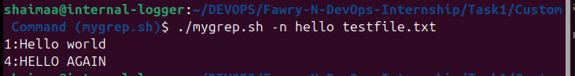
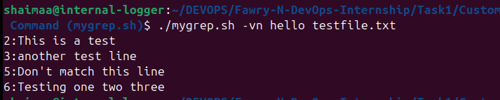
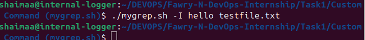
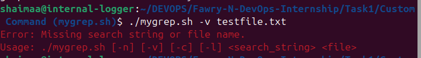

# Documentation for `mygrep.sh`

## Overview
The `mygrep.sh` script is a custom Bash implementation of the `grep` command. It provides functionality to search for patterns in files with support for various command-line options. The script mimics the behavior of `grep` while ensuring robust error handling for invalid inputs.

## Features
- **Core Functionality**:
    - Search for a string in a file (case-insensitive by default).
    - Print matching lines from the file.
- **Command-Line Options**:
    - `-n`: Display line numbers for each match.
    - `-v`: Invert the match (show lines that do not match).
    - `-c`: Count the number of matching lines.
    - `-l`: List files containing matches.
    - `-I`: Perform a case-sensitive search (disables default case-insensitive behavior).
    - `-E`: Enable extended regular expressions.
    - Supports combinations of options (e.g., `-vn`, `-cl`).
- **Error Handling**:
    - Validates the presence of required arguments (search string and file).
    - Checks file existence and readability.
    - Displays clear error messages for invalid inputs.
- **Bonus Features**:
    - Includes a `--help` flag to display usage information.
    - Enhanced option parsing using `getopts`.

## Repository Structure

The repository includes the following files:

```
/home/shaimaa/DEVOPS/Fawry-N-DevOps-Internship/Task1/Custom Command (mygrep.sh)/
├── mygrep.sh          # Main script implementing the custom grep functionality.
├── help.sh            # Helper script containing the `display_help` function.
├── testfile.txt       # Sample text file for testing the script.
├── README.md          # Documentation for the `mygrep.sh` script.
├── screenshots/       # Directory containing screenshots of example commands.
```

## Usage
### Example Commands with Screenshots

1. **Basic Search**:
    ```bash
    ./mygrep.sh hello testfile.txt
    ```
    Output: Prints lines containing the word "hello" (case-insensitive by default).

    

2. **Search with Line Numbers**:
    ```bash
    ./mygrep.sh -n hello testfile.txt
    ```
    Output: Prints matching lines with their line numbers.

    

3. **Invert Match with Line Numbers**:
    ```bash
    ./mygrep.sh -vn hello testfile.txt
    ```
    Output: Prints lines that do not contain "hello" with their line numbers.

    

4. **Case-Sensitive Search**:
    ```bash
    ./mygrep.sh -I hello testfile.txt
    ```
    Output: Prints lines containing the word "hello" (case-sensitive, as `-I` disables the default case-insensitive behavior).

    

5. **Count Matching Lines**:
    ```bash
    ./mygrep.sh -c hello testfile.txt
    ```
    Output: Displays the number of lines containing the word "hello".

    

6. **List Files with Matches**:
    ```bash
    ./mygrep.sh -l hello testfile.txt
    ```
    Output: Displays the file name if it contains matches.

    

7. **Missing Search String or File Name**:
    ```bash
    ./mygrep.sh -v testfile.txt
    ```
    Output: Displays an error message indicating the missing search string.

    

## Arguments and Options Handling

- The script uses `getopts` to parse short options like `-n`, `-v`, `-c`, and `-l`.
- After parsing options, the script uses `shift` to move past the options and fetch the search string and filename.
- It checks if enough arguments are passed (both search string and file).
- It validates if the provided file exists and is readable.
- If the `-l` option is used, it highlights the filename in purple if a match is found.
- If `--help` is passed as the first argument, it prints the help information from `help.sh` and exits.

## If Extended Support (Regex, etc.)

When we add support for advanced regex (`-E`) or more options:
- We would need to modify the `grep_options` variable to handle `-E`.
- Allow disabling default case-insensitive `-i` when `-I` is specified.
- Validate conflicts (for example, if `-i` and `-I` are passed together, decide priority).
- Possibly improve `getopts` with a more advanced parser for long options.

## Reflection

- **Hardest part**: The trickiest part was correctly parsing multiple combined options (like `-vn` or `-nv`) and ensuring that invalid combinations or missing arguments were gracefully handled with user-friendly messages.
- **Lesson learned**: Good error handling and clear user guidance (help messages) are very important, even in small scripts.
## Notes
- The script is a simplified version of `grep` with additional error handling.
- It is designed to handle invalid inputs (e.g., missing file or insufficient arguments) gracefully.

## License
This project is licensed under the MIT License.
