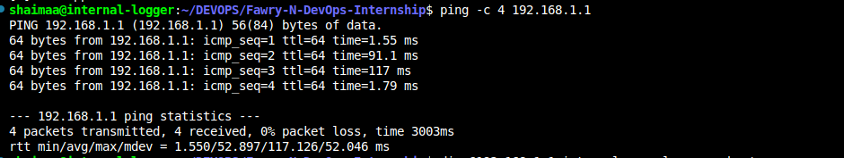

# Troubleshooting Connectivity to `internal.example.com`

##  Objective
Troubleshoot and restore connectivity to `internal.example.com` by verifying DNS resolution, diagnosing service reachability, tracing possible causes, and proposing/implementing fixes.

---

#  Task Breakdown

## 1. Verify DNS Resolution

### Step 1: Basic DNS Check
```bash
nslookup internal.example.com
```
**Result:**
- Local DNS resolver (127.0.0.53) can't find the record.

**Screenshot:**


---

### Step 2: Lightweight DNS Check
```bash
host internal.example.com
```
**Result:**
- Confirms DNS resolution issue.

---

### Step 3: Check Local DNS Resolver
```bash
ping -c 4 127.0.0.53
```
**Result:**
- `systemd-resolved` is running.

**Screenshot:**


---

### Step 4: Test Against Public DNS (8.8.8.8)
```bash
nslookup internal.example.com 8.8.8.8
```
**Result:**
- NXDOMAIN as expected (private domain).

**Screenshot:**


---

## 2. Diagnose Service Reachability

### Step 5: Review DNS Settings
```bash
cat /etc/resolv.conf
```
**Result:**
- Only stub resolver `127.0.0.53` configured.

**Screenshot:**


---

### Step 6: Check systemd-resolved Configuration
```bash
resolvectl status
```
**Result:**
- Wireless (wlo1) uses `192.168.1.1` as DNS.

**Screenshot:**


---

### Step 7: Test Internal DNS Server Reachability
```bash
ping -c 4 192.168.1.1
```
**Result:**
- DNS server reachable.

**Screenshot:**


---

### Step 8: Test Direct DNS Query
```bash
dig @192.168.1.1 internal.example.com +short
```
**Result:**
- No record found.

**Screenshot:**


---

### Step 9: Try Alternative Internal Domains
```bash
dig @192.168.1.1 internal

dig @192.168.1.1 internal.example.local

dig @192.168.1.1 internal.example.lan

dig @192.168.1.1 internal.example.prv
```
**Result:**
- No useful alternative records found.

**Screenshot:**
 

---

### Step 10: Test HTTP Connectivity
```bash
curl -v http://internal.example.com
```
**Result:**
- Fails at DNS lookup stage.

---

### Step 11: Check Listening Services (Ports 80/443)
```bash
sudo ss -tulnp | grep -E ':80|:443'
```
**Result:**
- Apache running on port 80.
- No HTTPS (port 443).

**Screenshot:**


---

### Step 12: Check Apache Virtual Hosts
```bash
sudo apache2ctl -S
```
**Result:**
- No VirtualHost for `internal.example.com`, only default site.

**Screenshot:**


---

## 3. Trace the Issue – Possible Causes

| Possible Cause | Confirmation Method |
|:--------------|:---------------------|
| Incorrect DNS server used | `dig @192.168.1.1 internal.example.com` |
| No DNS record present in internal DNS | `dig` shows empty result |
| Apache misconfiguration (missing VirtualHost) | `apache2ctl -S` |
| Firewall blocking access to port 80 | `sudo ufw status` or `sudo iptables -L` |
| Host routing/networking issues | `ping`, `traceroute`, etc. |

---

## 4. Propose and Apply Fixes

| Issue | How to Confirm | Solution |
|------|----------------|----------|
| Incorrect DNS server | `dig @192.168.1.1 internal.example.com` returns no record | Update DNS settings to correct internal DNS server |
| No DNS record present | No response from `dig` | Add record on internal DNS or temporary `/etc/hosts` |
| Apache missing VirtualHost | `apache2ctl -S` output | Create proper VirtualHost config for `internal.example.com` |
| Firewall blocking access | `ufw status` or `iptables -L` shows blocked | Allow ports 80/443 in firewall |

---

#  Commands for Fixes

###  Temporary DNS Fix (/etc/hosts)

**Backup hosts file first:**
```bash
sudo cp /etc/hosts /etc/hosts.bak
```

**Add entry:**
```bash
echo '192.168.1.x internal.example.com' | sudo tee -a /etc/hosts
```
**Screenshot:**

---

###  Persistent DNS Configuration (systemd-resolved)

Edit `/etc/systemd/resolved.conf`:
```bash
sudo nano /etc/systemd/resolved.conf
```
Add/modify:
```bash
[Resolve]
DNS=192.168.1.1
Domains=example.com
```
**Screenshot:**


Then restart service:
```bash
sudo systemctl restart systemd-resolved
```

---

### Persistent DNS (NetworkManager - optional)

Check active connections:
```bash
nmcli con show
```

Set custom DNS:
```bash
nmcli con mod <connection-name> ipv4.dns "192.168.1.1"
nmcli con up <connection-name>
```

---

###  Firewall Fix

Check firewall status:
```bash
sudo ufw status
sudo iptables -L -n -v
```

Allow ports:
```bash
sudo ufw allow 80/tcp
sudo ufw allow 443/tcp
```


---

# 🏆 Bonus Section

| Bonus Task | Command |
|:-----------|:--------|
| Validate fix after `/etc/hosts` | `ping internal.example.com` then `curl -v http://internal.example.com` |

---

# 📋 Folder Structure

```bash
Scenario/
├── README.md
├── screenshots/
│   ├── image1.png
│   ├── image2.png
│   ├── image3.png
│   ├── image4.png
│   ├── image5.png
│   ├── image6.png
│   ├── image7.png
│   ├── image8.png
│   ├── image9.png
│   ├── image10.png
│   ├── image11.png
│   ├── image12.png
│   ├── image13.png
│   └── image14.png
└── session.txt

```

---

# Conclusion
- DNS issue confirmed at the local resolver.
- Apache service running but no specific VirtualHost configured for `internal.example.com`.
- Firewall verified to be open.
- Temporary `/etc/hosts` entry successfully bypasses DNS until DNS server is fixed.
- Final verification using `ping` and `curl` shows service is reachable.

---


