# Git Task Documentation

## Overview

This task demonstrates branch management, commit operations, reset & reflog usage, and rebasing in Git. The repository contains two branches: `develop` and `alpha`. Various commits and operations were performed to explore Git functionalities.

---

## Branch Setup

- Created two branches:  
  - `develop`  
  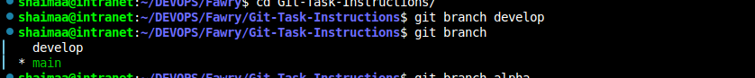  
  - `alpha`
   

---

## Part 1: Work on `develop` Branch

1. Switched to the `develop` branch:
    ```bash
    git checkout develop
    ```
      
    
2. Created two files `file1` and `file2` and added content:
    ```bash
    echo "Content for file1" > file1
    echo "Content for file2" > file2
    ```
     
3. Committed files separately:
    ```bash
    git add file1
    git commit -m "first-commit"
     ```
    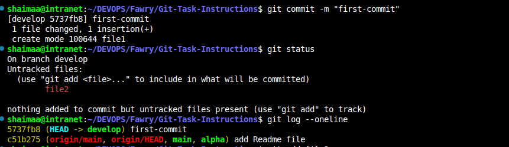 
     ```
    git add file2
    git commit -m "second-commit"
    ```
     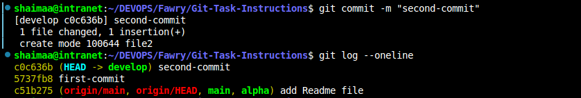 
4. Viewed log in one-line format:

    

5. Used `git reset --hard HEAD~1` to move back to the first commit:

    ```bash
    git reset --hard HEAD~1
    ```

    

6. Used `git reflog` to find previous commit, then reset back:

    ```bash
    git reflog
    git reset --hard Head@{1}
    ```
   

---

## Part 2: Work with `alpha` Branch

1. Switched to `alpha` branch and created `file3`, committed:

    ```bash 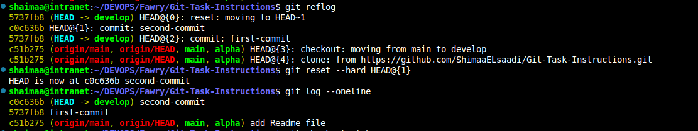  
    git checkout alpha
    ```
      

    ```
    echo "Content for file3" > file3
    git add file3
    ```
    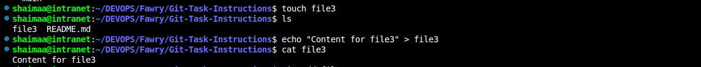  

    ```
    git commit -m "third-commit"
    ```
    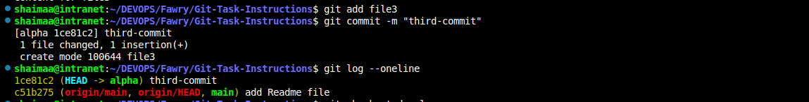 
2. Switched back to `develop`, created `file4`, and committed:

    ```bash
    git checkout develop
    ```
    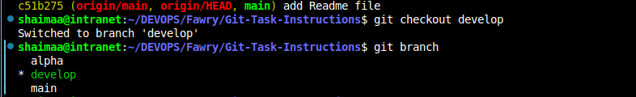 

    ```
    echo "Content for file4" > file4
    git add file4
    ```
    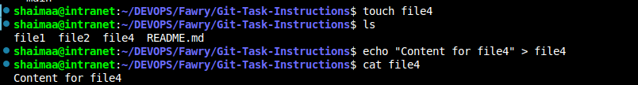  

    ```
    git commit -m "fourth-commit"
    ```
    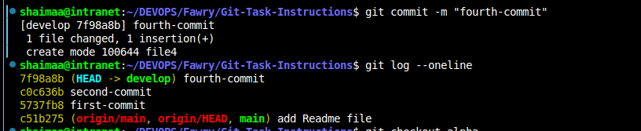 

3. Switched again to `alpha` and visualized log graph:

    ```bash
    git checkout alpha
     ```
      

    ```
    git log --oneline --decorate --all --graph
    ```

    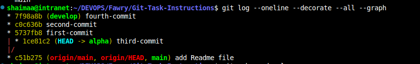

---

## Part 3: Rebase Operation

1. Rebasing `develop` onto `alpha`:

    ```bash
    git rebase develop
    ```

    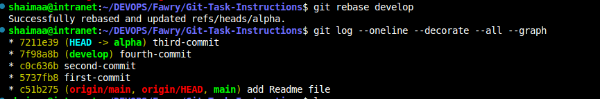

---

## Summary

- Created and worked with multiple branches (`develop`, `alpha`).
- Performed commits, resets, and used reflog to recover commits.
- Visualized branch history using `git log --graph`.
- Executed a rebase operation to integrate changes.

---

**Screenshots:** All screenshots are stored in the `screenshots` folder.

---
## Related Repository

You can find the related repository for this task here:  
[Git-Task-instructions](https://github.com/ShimaaELsaadi/Git-Task-Instructions.git)
